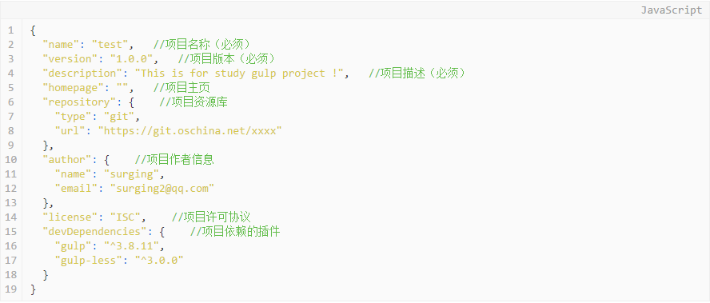
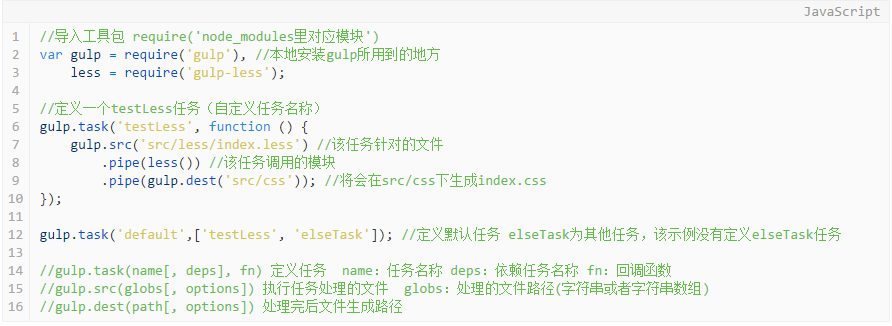

##Gulp 安装与使用
######gulp是前端开发过程中对代码进行构建的工具，是自动化项目的构建利器；她不仅能对网站资源进行优化，而且在开发过程中很多重复的任务能够使用正确的工具自动完成；使用她，我们不仅可以很愉快的编写代码，而且大大提高我们的工作效率
######gulp是基于Nodejs的自动任务运行器， 她能自动化地完成 javascript/coffee/sass/less/html/image/css 等文件的的测试、检查、合并、压缩、格式化、浏览器自动刷新、部署文件生成，并监听文件在改动后重复指定的这些步骤。在实现上，她借鉴了Unix操作系统的管道（pipe）思想，前一级的输出，直接变成后一级的输入，使得在操作上非常简单。通过本文，我们将学习如何使用Gulp来改变开发流程，从而使开发更加快速高效。
>gulp 和 grunt 非常类似，但相比于 grunt 的频繁 IO 操作，gulp 的流操作，能更快地更便捷地完成构建工作。
#####安装流程：
>安装nodejs -> 全局安装gulp -> 项目安装gulp以及gulp插件 -> 配置gulpfile.js -> 运行任务
###1、安装nodejs
>1.1、说明：gulp是基于nodejs，理所当然需要安装nodejs。
>1.2、安装：打开nodejs官网https://nodejs.org/en/，点击硕大的绿色Download按钮，它会根据系统信息选择对应版本（.msi文件）。然后像安装QQ一样安装它就可以了（安装路径随意）。
###2、使用命令行（如果你熟悉命令行，可以直接跳到第3步）
>2.1、说明：什么是命令行？命令行在OSX是终端（Terminal），在windows是命令提示符（Command Prompt）；
>2.2、注：之后操作都是在windows系统下；
>2.3、简单介绍gulp在使用过程中常用命令，打开命令提示符执行下列命令（打开方式：window + r 输入cmd回车）：
>2.4、node -v查看安装的nodejs版本，出现版本号，说明刚刚已正确安装nodejs。PS：未能出现版本号，请尝试注销电脑重试；
>2.5、npm -v查看npm的版本号，npm是在安装nodejs时一同安装的nodejs包管理器，那它有什么用呢？稍后解释；
>2.6、cd定位到目录，用法：cd + 路径 ；
>2.8、dir列出文件列表；
>2.9、cls清空命令提示符窗口内容。

###3、npm介绍
#####npm（node package manager）nodejs的包管理器，用于node插件管理（包括安装、卸载、管理依赖等）
#####PS：npm安装插件过程：从http://registry.npmjs.org下载对应的插件包（该网站服务器位于国外，所以经常下载缓慢或出现异常），解决办法往下看↓↓↓↓↓↓。
###4、选装cnpm
>4.1、说明：因为npm安装插件是从国外服务器下载，受网络影响大，可能出现异常，如果npm的服务器在中国就好了，所以我们乐于分享的淘宝团队干了这事。32个！来自官网：“这是一个完整 npmjs.org 镜像，你可以用此代替官方版本(只读)，同步频率目前为 10分钟 一次以保证尽量与官方服务同步。”；
>4.2、官方网址：http://npm.taobao.org；
>4.3、安装：命令提示符执行npm install cnpm -g --registry=https://registry.npm.taobao.org；

#####注意：安装完后最好查看其版本号cnpm -v或关闭命令提示符重新打开，安装完直接使用有可能会出现错误；

#####注：cnpm跟npm用法完全一致，只是在执行命令时将npm改为cnpm（以下操作将以cnpm代替npm）。

###5、全局安装gulp
>5.1、说明：全局安装gulp目的是为了通过她执行gulp任务；
>5.2、安装：命令提示符执行cnpm install gulp -g；
>5.3、查看是否正确安装：命令提示符执行gulp -v，出现版本号即为正确安装。

###6、新建package.json文件
>6.1、说明：package.json是基于nodejs项目必不可少的配置文件，它是存放在项目根目录的普通json文件；
>6.2、它是这样一个json文件（注意：json文件内是不能写注释的，复制下列内容请删除注释）：

>6.3、当然我们可以手动新建这个配置文件，但是作为一名有志青年，我们应该使用更为效率的方法：命令提示符执行cnpm init.

>6.4、查看package.json帮助文档，命令提示符执行cnpm help package.json
特别注意：package.json是一个普通json文件，所以不能添加任何注释。参看 http://www.zhihu.com/question/23004511
###7、本地安装gulp插件
>7.1、安装：定位目录命令后提示符执行cnpm install --save-dev；
>7.2、本示例以gulp-less为例（编译less文件），命令提示符执行cnpm install gulp-less --save-dev；

>7.3、将会安装在node_modules的gulp-less目录下，该目录下有一个gulp-less的使用帮助文档README.md；
>7.4、为了能正常使用，我们还得本地安装gulp：cnpm install gulp --save-dev；
PS：细心的你可能会发现，我们全局安装了gulp，项目也安装了gulp，全局安装gulp是为了执行gulp任务，本地安装gulp则是为了调用gulp插件的功能。
###8、新建gulpfile.js文件（重要）
>8.1、说明：gulpfile.js是gulp项目的配置文件，是位于项目根目录的普通js文件（其实将gulpfile.js放入其他文件夹下亦可）。
>8.2、它大概是这样一个js文件（更多插件配置请查看这里）：

###9、运行gulp
>9.1、说明：命令提示符执行gulp 任务名称；
>9.2、编译less：命令提示符执行gulp testLess；
>9.3、当执行gulp default或gulp将会调用default任务里的所有任务[‘testLess’,’elseTask’]。
####安装完毕